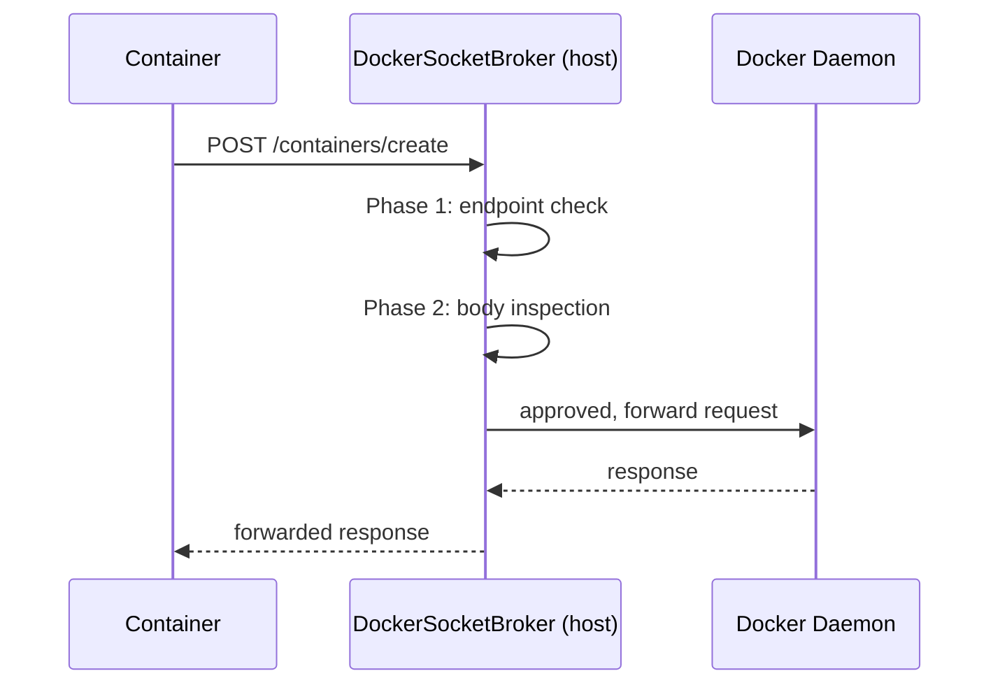
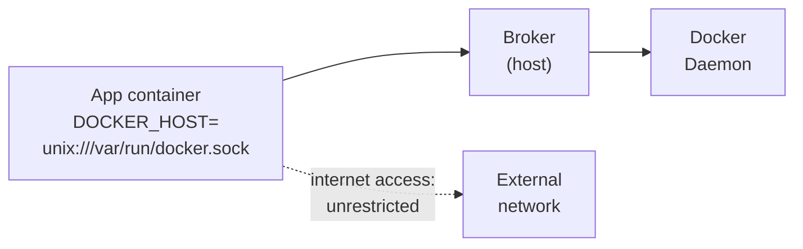
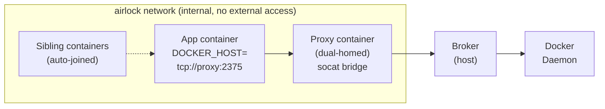

If you just want the feature overview, [check out the copilot_here site](https://gordonbeeming.com/copilot_here/#docker-broker). If you want the setup steps, head to the [setup guide](/blog/2026-04-09/setting-up-docker-in-docker-in-copilot-here). This post is the longer story: why I built the brokered Docker socket, how the internals work, and where the boundaries are.

## The problem

AI coding agents inside a sandbox need Docker access. Testcontainers spins up a database for integration tests. A build pipeline calls `docker build`. A test harness starts a Redis sidecar. All of these need a working Docker socket.

The naive approach is to bind-mount the host's `/var/run/docker.sock` into the container:

```bash title="Terminal"
# This works. It's also terrifying.
docker run -v /var/run/docker.sock:/var/run/docker.sock myimage
```

That socket is the Docker daemon's control plane. Whatever can reach it can:

- Pull and run any image, including ones with host filesystem mounts
- Spawn privileged containers with full host kernel access
- Bind-mount `/etc`, `/root`, or the Docker socket itself into a new container
- Attach to running containers on the host
- Effectively become root on the host machine

For a human developer, this is a calculated risk. You trust yourself not to run `docker run --privileged -v /:/host alpine sh`. For an AI agent operating autonomously, that trust is harder to justify.

## What a broker changes

Instead of handing the container the real Docker socket, copilot_here starts a host-side broker process that creates its own socket. The container connects to the broker, the broker decides whether to forward the request to the real daemon.



The broker sits in the copilot_here host process (C#/.NET, AOT compiled). On Linux and macOS it listens on a Unix domain socket at `/tmp/copilot-broker-{sessionId}.sock`. On Windows it uses a TCP loopback port reached through `host.docker.internal`. Either way, the container sees a normal Docker socket at `/var/run/docker.sock`. It has no idea a broker is in the middle.

## Phase 1: Endpoint whitelist

Every Docker API call is an HTTP request — `GET /containers/json`, `POST /containers/create`, `DELETE /images/sha256:abc123`. The broker maintains an explicit allowlist of method + path pairs. Currently 65 endpoints are allowed by default:

```json title="Subset of default-docker-broker-rules.json"
{
  "allowed_endpoints": [
    { "method": "GET",    "path": "/_ping" },
    { "method": "GET",    "path": "/containers/json" },
    { "method": "POST",   "path": "/containers/create" },
    { "method": "POST",   "path": "/containers/*/start" },
    { "method": "POST",   "path": "/containers/*/stop" },
    { "method": "DELETE", "path": "/containers/*" },
    { "method": "GET",    "path": "/images/json" },
    { "method": "POST",   "path": "/images/create" },
    { "method": "GET",    "path": "/networks" },
    { "method": "POST",   "path": "/networks/create" }
  ]
}
```

Path matching is segment-aware: `*` matches exactly one path segment, `**` matches zero or more. API version prefixes (like `/v1.43/`) are stripped before matching. Anything not in the list gets a 403. Default-deny.

## Phase 2: Body inspection

Endpoint filtering handles the "which API calls are allowed" question. Body inspection handles "what configuration is allowed inside those calls." It only runs on `POST /containers/create` — that's where the dangerous configuration lives.

The inspector parses the JSON body and checks five things:

### Image allowlist

The most important check. The `allowed_images` list starts **empty**, meaning no sibling containers can be spawned at all until you explicitly add patterns. The safe default for an AI agent is "name every image you trust, deny everything else."

```json title="Example configuration"
{
  "body_inspection": {
    "allowed_images": [
      "mcr.microsoft.com/mssql/server:*",
      "postgres:*",
      "testcontainers/ryuk:*",
      "redis:7*"
    ]
  }
}
```

Patterns use glob matching. `*` matches any sequence of characters including slashes and colons.

### Privilege rejection

Blocks `HostConfig.Privileged = true`. A privileged container has unrestricted access to the host kernel: device access, all capabilities, no seccomp filtering. Default: reject.

### Host namespace rejection

Blocks `NetworkMode`, `PidMode`, `IpcMode`, or `UsernsMode` set to `"host"`. Sharing the host's network, PID, IPC, or user namespace breaks container isolation. Default: reject.

### Forbidden bind mounts

Inspects `HostConfig.Binds` and blocks mounts targeting:

- `/` (host root)
- `/etc`, `/root`, `/var`, `/usr`, `/bin`, `/sbin`
- `/proc`, `/sys`
- `/var/run/docker.sock`, `/run/docker.sock`

Subpath matching is included, so `/etc/passwd` is caught by the `/etc` rule. Default: reject.

### Dangerous capabilities

Blocks `CapAdd` entries from a deny list: `SYS_ADMIN`, `SYS_MODULE`, `SYS_PTRACE`, `SYS_RAWIO`, `SYS_BOOT`, `MAC_ADMIN`, `MAC_OVERRIDE`, `DAC_READ_SEARCH`, `NET_ADMIN`, `AUDIT_CONTROL`. These capabilities let a container escape its sandbox in various ways. Default: reject.

Each of these checks can be individually toggled off via the config file if a specific workflow requires it.

## Standard mode vs Airlock mode

### Standard mode

The simplest setup. The broker listens on a socket, the container mounts it, Docker calls go through the broker. The container can reach the internet normally — only Docker API calls are mediated.



### Airlock mode

When DinD is combined with Airlock, there's more going on. The app container sits on an internal-only network and cannot reach the outside world directly. A proxy container bridges the gap.



The proxy container runs a Rust HTTP/HTTPS proxy for regular traffic plus a `socat` bridge that forwards Docker API calls from port 2375 to the host broker. The app container's `DOCKER_HOST` points at `tcp://proxy:2375`.

Here's the part that took the most thought: when the broker inspects a `POST /containers/create` request in airlock mode, it rewrites the `NetworkMode` field. Siblings that would normally land on the default bridge network get placed on the airlock network instead. This means:

- Siblings are reachable from the app container via Docker DNS (e.g., `mssql:1433`)
- Siblings are also network-isolated, meaning they can only reach the proxy, not the external network directly
- The airlock's HTTP/HTTPS filtering still applies to their traffic

Without this rewrite, Testcontainers would start a database on the bridge network and the airlocked app container couldn't talk to it.

**Known limitation:** The airlock network is `internal: true`, which means the workload container can't reach host-mapped ports. Testcontainers and similar frameworks that connect to siblings via `host.docker.internal:<random-port>` will time out in airlock mode. This is tracked in [#101](https://github.com/GordonBeeming/copilot_here/issues/101). The workaround is to use standard mode (`--dind` without airlock) where the broker still enforces all Docker API rules, you just lose the HTTP proxy network isolation.

## Design decisions

**Why a userspace proxy instead of eBPF or seccomp?** Portability. The broker runs on Linux, macOS, and Windows. eBPF is Linux-only and seccomp can't inspect HTTP request bodies. A userspace proxy works everywhere and can parse JSON.

**Why default-deny with an empty image allowlist?** Because "opt-in to specific risk" is fundamentally safer than "opt-out of specific risk." An AI agent that can spawn any image is an AI agent that can pull a purpose-built escape tool. By starting empty, users must make a conscious decision about which images to trust.

**Why inspect bodies and not just endpoints?** Because `POST /containers/create` is a single endpoint that can produce wildly different security outcomes depending on the body. A container with `"Privileged": true` is a completely different threat than one without it. Endpoint filtering alone can't distinguish between the two.

**Why hand-rolled HTTP framing instead of Kestrel?** The broker needs to handle Docker's HTTP Upgrade protocol for `exec` and `attach` (WebSocket-style bidirectional streaming). After the request line is approved, the broker splices raw TCP streams rather than parsing the full HTTP body. This handles content-length, chunked transfer, and upgrade hijacking without a full HTTP server.

## Remaining attack surface

The broker shrinks the attack surface. It does not eliminate it. Here's what's still exposed:

**Exec into siblings.** `POST /containers/*/exec` is in the endpoint allowlist and has no body inspection. An agent could exec arbitrary commands in any running sibling container. If that sibling has access to something the agent doesn't (a mounted secret, a network connection), exec is the bridge.

**Docker build.** `POST /build` is allowed. A Dockerfile's `RUN` commands execute on the host Docker daemon during the build. A malicious Dockerfile could exfiltrate data, install backdoors in the built image, or probe the host network during build.

**Archive write.** `PUT /containers/*/archive` lets files be written into running containers. An agent could inject a script into a running sibling's filesystem and then exec it.

**Tag trust.** Image allowlist patterns like `postgres:*` trust every tag published to that repository. If an upstream image is compromised and a malicious tag is pushed, it would pass the allowlist. Use specific version tags where possible (e.g., `postgres:16.2` instead of `postgres:*`).

These vectors require the agent to be actively trying to escape rather than accidentally doing something dangerous. The broker catches the common accidental cases: a coding agent that runs `docker run --privileged` because it found that in a Stack Overflow answer, or one that tries to mount `/etc` because a build script asked for it.

For maximum lockdown, combine the broker with Airlock mode. Network isolation means even if an agent compromises a sibling container, that container can't reach anything outside the airlock network without going through the proxy.

## What's next

The broker is marked as beta. Whether body inspection gets extended to other endpoints (like exec or build) depends on feedback from people actually using it. If you hit a case where the current scope doesn't work for you, [open an issue](https://github.com/GordonBeeming/copilot_here/issues).

If you want to set it up, the [setup guide](/blog/2026-04-09/setting-up-docker-in-docker-in-copilot-here) walks through enabling the broker, configuring image allowlists, and tuning privilege controls per repo. Or check the [copilot_here site](https://gordonbeeming.com/copilot_here/#docker-broker) for the quick overview.
