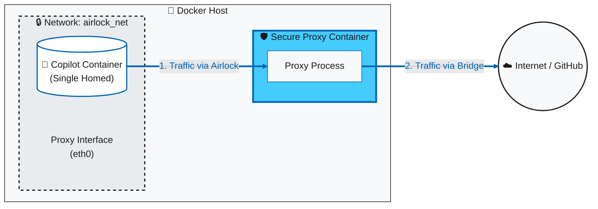

# copilot_here: A Secure, Portable Copilot CLI Environment

Run the GitHub Copilot CLI from any directory on your machine, inside a sandboxed Docker container that automatically uses your existing `gh` authentication.

[](https://github.com/GordonBeeming/copilot_here/actions/workflows/publish.yml)

## 🚀 What is this?

This project solves a simple problem: you want to use the awesome [GitHub Copilot CLI](https://github.com/features/copilot/cli), but you also want a clean, portable, and secure environment for it.

The `copilot_here` shell function is a lightweight wrapper around a Docker container. When you run it in a terminal, it:
- **Enhances security** by isolating the tool in a container, granting it file system access **only** to the directory you're currently in. 🛡️
- **Keeps your machine clean** by avoiding a global Node.js installation.
- **Authenticates automatically** by using your host machine's existing `gh` CLI credentials.
- **Validates token permissions** by checking for required scopes and warning you about overly permissive tokens.
- **Persists its configuration**, so it remembers which folders you've trusted across sessions.
- **Stays up-to-date** by automatically pulling the latest image version on every run.

> Already seen Docker's `sbx`? Jump to [copilot_here vs Docker Sandboxes](#-copilot_here-vs-docker-sandboxes) for the side-by-side.

## ✅ Prerequisites

Before you start, make sure you have the following installed and configured on your machine:
- **Container Runtime**: [Docker Desktop](https://www.docker.com/products/docker-desktop/), [OrbStack](https://orbstack.dev/), or [Podman](https://podman.io/). The system will auto-detect your available runtime.
- The [GitHub CLI (`gh`)](https://cli.github.com/).
- You must be logged in to the GitHub CLI. You can check by running `gh auth status`. Your token **must** have the `copilot` and `read:packages` scopes. If it doesn't, run `gh auth refresh -h github.com -s copilot,read:packages` to add them.

## 🛠️ Setup Instructions

Choose your platform below. The scripts include both **Safe Mode** (asks for confirmation) and **YOLO Mode** (auto-approves) functions. You can use either or both depending on your needs.

### Execution Modes

**Safe Mode (`copilot_here`)** - Always asks for confirmation before executing commands. Recommended for general development work where you want control over what gets executed.

**YOLO Mode (`copilot_yolo`)** - Automatically approves all tool usage without confirmation. Convenient for trusted workflows but use with caution as it can execute commands without prompting.

### Image Variants

All images support both **AMD64** (x86_64) and **ARM64** (Apple Silicon, etc.) architectures.

All functions support switching between Docker image variants using flags:
- **No flag** - Base image (Node.js, Python with pip & pipx, Git, basic tools)
- **`--dotnet`** (`-d`) - .NET image (includes .NET 8, 9 & 10 SDKs)
- **`--dotnet8`** (`-d8`) - .NET 8 image (includes .NET 8 SDK)
- **`--dotnet9`** (`-d9`) - .NET 9 image (includes .NET 9 SDK)
- **`--dotnet10`** (`-d10`) - .NET 10 image (includes .NET 10 SDK)
- **`--playwright`** (`-pw`) - Playwright image (includes browser automation)
- **`--dotnet-playwright`** (`-dp`) - .NET + Playwright image (includes browser automation)
- **`--rust`** (`-rs`) - Rust image (includes Rust toolchain)
- **`--dotnet-rust`** (`-dr`) - .NET + Rust image
- **`--golang`** (`-go`) - Golang image (includes Go toolchain)
- **`--java`** (`-j`) - Java image (includes JDK 25, Maven, Gradle, PlantUML)
- **`--image <name>`** (`-i`) - Use any custom Docker image (e.g., `my-image:tag`, `registry.io/org/image:v1`, `image@sha256:<digest>`)

### Additional Options

- **`-h` or `--help`** - Show usage help and examples
- **`--no-cleanup`** - Skip cleanup of unused Docker images
- **`--no-pull`** - Skip pulling the latest image
- **`--dind`** *(beta)* - Enable brokered Docker socket access for Testcontainers and sibling-container workflows. See [Brokered Docker Socket](#-brokered-docker-socket-dind--beta) below.
- **`--mount <path>`** - Mount a directory as read-only (supports `path` or `host:container` format)
- **`--mount-rw <path>`** - Mount a directory as read-write (supports `path` or `host:container` format)
- **`--save-mount <path>`** - Save a mount to local config
- **`--save-mount-global <path>`** - Save a mount to global config
- **`--remove-mount <path>`** - Remove a saved mount
- **`--list-mounts`** - List all configured mounts
- **`--update`** (`-u`) - Update from GitHub repository

### Copilot CLI Options

These options are passed directly to the GitHub Copilot CLI:
- **`-p <prompt>` or `--prompt <prompt>`** - Execute a prompt directly
- **`--model <model>`** - Set AI model (e.g., `claude-sonnet-4.5`, `gpt-5`)
- **`--continue`** - Resume most recent session
- **`--resume <sessionId>`** - Resume from a previous session
- **`--help2`** - Show GitHub Copilot CLI native help

> ⚠️ **Security Note:** Both modes check for proper GitHub token scopes and warn about overly privileged tokens.

### Directory Mounting

By default, `copilot_here` only mounts the current working directory. You can mount additional directories using flags or configuration files.

**CLI Flags:**
- `--mount ./path/to/dir` (Read-only, auto-computed container path)
- `--mount-rw ./path/to/dir` (Read-write, auto-computed container path)
- `--mount /host/path:/container/path` (Read-only, custom container path)
- `--mount-rw /host/path:/container/path` (Read-write, custom container path)

**Configuration Files:**
- Global: `~/.config/copilot_here/mounts.conf`
- Local: `.copilot_here/mounts.conf`

**Format:** `path/to/dir:ro` or `path/to/dir:rw` (one per line)

**Management Commands:**
Use `--save-mount`, `--save-mount-global`, `--remove-mount`, and `--list-mounts` to manage persistent mounts.

### Image Management

You can configure the default image tag to use (e.g., `dotnet`, `dotnet-playwright`, or a specific SHA) so you don't have to pass flags every time.

**Management Commands:**
- `--list-images` - List all available Docker images
- `--show-image` - Show current default image configuration
- `--set-image <tag>` - Set default image in local config
- `--set-image-global <tag>` - Set default image in global config
- `--clear-image` - Clear default image from local config
- `--clear-image-global` - Clear default image from global config

**Configuration Files:**
- Global: `~/.config/copilot_here/image.conf`
- Local: `.copilot_here/image.conf`

**Custom image behavior:**
- Custom image refs are accepted for CLI/config values, including local refs like `my-local-image:dev`
- Default behavior is to pull before run
- Use `--no-pull` to force local-only execution

### Model Management

You can configure the default AI model to use so you don't have to pass `--model` every time.

**Management Commands:**
- `--list-models` - List available AI models (queries Copilot CLI error message)
- `--show-model` - Show current default model configuration
- `--set-model <model-id>` - Set default model in local config
- `--set-model-global <model-id>` - Set default model in global config
- `--clear-model` - Clear default model from local config
- `--clear-model-global` - Clear default model from global config

**Special value:** Use `default` as the model ID to explicitly use Copilot CLI's default model. This is useful for overriding a global setting at the local level.

**Note:** The `--list-models` command uses a workaround by triggering an invalid model error, which causes the Copilot CLI to list valid models. This is a temporary approach until a proper API is available.

**Configuration Files:**
- Global: `~/.config/copilot_here/model.conf`
- Local: `.copilot_here/model.conf`

**Configuration Priority:**
1. CLI argument (`--model <model-id>`)
2. Local config (`.copilot_here/model.conf`)

### Container Runtime Management

`copilot_here` supports multiple container runtimes: **Docker**, **OrbStack**, and **Podman**. The system automatically detects the available runtime, but you can also configure a preferred runtime.

**Management Commands:**
- `--show-runtime` - Show current container runtime configuration
- `--list-runtimes` - List all available container runtimes on your system
- `--set-runtime <runtime>` - Set runtime in local config (values: `docker`, `podman`, or `auto`)
- `--set-runtime-global <runtime>` - Set runtime in global config

**Configuration Files:**
- Global: `~/.config/copilot_here/runtime.conf`
- Local: `.copilot_here/runtime.conf`

**Configuration Priority:**
1. Local config (`.copilot_here/runtime.conf`)
2. Global config (`~/.config/copilot_here/runtime.conf`)
3. Auto-detection (tries Docker first, then Podman)

**Supported Runtimes:**
- **Docker** - Standard Docker Engine or Docker Desktop
- **OrbStack** - Automatically detected when Docker context is set to OrbStack
- **Podman** - Open-source container runtime (auto-detects compose support)
3. Global config (`~/.config/copilot_here/model.conf`)
4. Default (GitHub Copilot CLI default)

**Example Usage:**
```bash
# Set model for current project
copilot_here --set-model gpt-5

# Set model globally for all projects
copilot_here --set-model-global claude-sonnet-4.5

# Override saved model for one session
copilot_here --model gpt-5-mini

# View current configuration
copilot_here --show-model
```

### Custom Docker Flags (SANDBOX_FLAGS)

Pass additional Docker flags using the `SANDBOX_FLAGS` environment variable (compatible with Gemini CLI):

**Examples:**

```bash
# Use host networking
export SANDBOX_FLAGS="--network host"
copilot_here

# Pass environment variables to the container
export SANDBOX_FLAGS="--env DEBUG=1 --env LOG_LEVEL=trace"

# Multiple flags (space-separated)
export SANDBOX_FLAGS="--network my-net --cap-add SYS_PTRACE"

# Resource limits
export SANDBOX_FLAGS="--memory 2g --cpus 1.5"

# Per-command override (doesn't set globally)
SANDBOX_FLAGS="--network dev" copilot_here
```

**Supported Flags:**
- `--network <name>` - Connect to a custom Docker network
- `--env <KEY=value>` - Set environment variables
- `--cap-add <capability>` - Add Linux capabilities
- `--cap-drop <capability>` - Drop Linux capabilities
- `--memory <limit>` - Set memory limit (e.g., `2g`, `512m`)
- `--cpus <number>` - Set CPU limit (e.g., `1.5`)
- `--ulimit <type>=<limit>` - Set ulimits (e.g., `nofile=1024`)

**Airlock Mode:**
When using `--enable-airlock`, the `--network` flag changes the proxy's external network while maintaining app container isolation. The app container remains on the internal airlock network and can only access the proxy, which then routes to your specified network.

```bash
# Example: Proxy connects to custom network while app stays isolated
docker network create my-services
SANDBOX_FLAGS="--network my-services" copilot_here --enable-airlock
```

### 🛡️ Airlock (Network Isolation)

Airlock provides an additional layer of security by routing all network traffic from the Copilot CLI through a proxy that enforces an allowlist of permitted hosts and paths. This ensures that the AI can only communicate with approved endpoints.

**Key Features:**
- **Enforce Mode**: Blocks all network requests not matching the allowlist
- **Monitor Mode**: Logs all network activity without blocking (useful for auditing)
- **Configurable Rules**: Define allowed hosts and paths per-project or globally
- **Automatic Logging**: Monitor mode automatically enables request logging
- **Inherit Default Rules**: Optionally inherit rules from updates for easier maintenance

**Setup Commands:**
- `--enable-airlock` - Enable Airlock for current project
- `--enable-global-airlock` - Enable Airlock globally
- `--disable-airlock` - Disable Airlock for current project
- `--disable-global-airlock` - Disable Airlock globally

**Management Commands:**
- `--show-airlock-rules` - Display current Airlock configuration
- `--edit-airlock-rules` - Edit local Airlock rules in $EDITOR
- `--edit-global-airlock-rules` - Edit global Airlock rules in $EDITOR

**Configuration Files:**
- Global: `~/.config/copilot_here/network.json`
- Local: `.copilot_here/network.json`
- Default Rules: `~/.config/copilot_here/default-airlock-rules.json` (updated with script updates)

**Example Configuration:**
```json
{
  "enabled": true,
  "inherit_default_rules": true,
  "mode": "enforce",
  "enable_logging": false,
  "allowed_rules": [
    {
      "host": "api.github.com",
      "allowed_paths": ["/user", "/graphql"]
    },
    {
      "host": "api.individual.githubcopilot.com",
      "allowed_paths": ["/models", "/mcp/readonly", "/chat/completions"]
    }
  ]
}
```

**Modes:**
- **enforce** (`e`): Blocks requests not matching the allowlist
- **monitor** (`m`): Allows all requests but logs them for review

When enabling Airlock for the first time, you'll be prompted to choose between enforce and monitor mode.

**Logging:**
When `enable_logging` is true (or in monitor mode), request logs are saved to `.copilot_here/logs/` (excluded from git by default).

**Network Topology View**



1.  **🔒 The Sealed Chamber (Airlock Network):**
    The `copilot_here` container is launched into a private, internal-only network. It has **zero** direct access to the internet. If an application tries to bypass the proxy, the connection simply fails because there is no route out.

2.  **🛡️ The Sentry (Secure Proxy):**
    The Proxy is the only component with a "key" to the outside world. It sits with one foot in the Airlock (to listen for requests) and one foot in the Bridge network (to reach GitHub).

3.  **✅ The Controlled Exit:**
    Traffic can only leave the Airlock if it explicitly asks the Proxy to carry it. The Proxy inspects the destination against your allow-list and decides whether to let the request pass or block it.


### 🐳 Brokered Docker Socket (DinD) (Beta)

> 🧪 **Beta:** The brokered Docker socket is safer than mounting `/var/run/docker.sock` directly. Every Docker API call passes through a host-owned allowlist. Body-level inspection (rejecting `--privileged` and host bind mounts at request time) is the next phase. See [docs/known-issues.md](https://github.com/GordonBeeming/copilot_here/blob/main/docs/known-issues.md#brokered-docker-socket-beta) for what's in scope today.

The `--dind` flag lets the AI inside the container spawn sibling containers on the host's runtime. This unblocks Testcontainers integration tests, on-the-fly image builds, and any workflow where the agent needs `docker run`. The container never sees the real socket: a host-side broker inside the `copilot_here` binary forwards only the requests that match a JSON allowlist.

**Why it's safer than mounting the socket directly:**

- Every Docker API call passes through the host process. The host stays in control of which endpoints reach the daemon.
- Dangerous endpoint families are denied by default: `swarm`, `services`, `tasks`, `nodes`, `secrets`, `configs`, `plugins`, `session`, `distribution`, `auth`, `events`.
- The allowlist is configured per-project (`.copilot_here/docker-broker.json`) or globally (`~/.config/copilot_here/docker-broker.json`).
- `enforce` mode blocks unmatched requests with a 403. `monitor` mode allows everything but logs each call to a JSONL file you can audit.

**Quick start:**

```bash
# One-off session, using the embedded default rules.
copilot_here --dind --dotnet -p "run the integration tests"

# Persist to local project config.
copilot_here --enable-docker-broker
copilot_here --show-docker-broker-rules

# Allow specific images to be spawned (the broker is strict default-deny).
copilot_here --add-docker-broker-image 'mcr.microsoft.com/mssql/server:*'
copilot_here --add-docker-broker-image 'testcontainers/ryuk:*'

# Tweak the rules in $EDITOR.
copilot_here --edit-docker-broker-rules
```

**Setup Commands:**

- **`--enable-docker-broker`** - Enable the broker for current project
- **`--enable-global-docker-broker`** - Enable the broker globally
- **`--disable-docker-broker`** - Disable the broker for current project
- **`--disable-global-docker-broker`** - Disable the broker globally

**Trusted Image Commands:**

- **`--add-docker-broker-image <pattern>`** - Add an image glob to the local trusted list (e.g. `'alpine:*'`)
- **`--add-global-docker-broker-image <pattern>`** - Same, global config
- **`--remove-docker-broker-image <pattern>`** - Remove an image glob from local
- **`--remove-global-docker-broker-image <pattern>`** - Remove from global
- **`--allow-privileged-docker-broker`** / **`--deny-privileged-docker-broker`** - Toggle whether spawned siblings may request `HostConfig.Privileged=true` (default: deny)
- **`--allow-privileged-global-docker-broker`** / **`--deny-privileged-global-docker-broker`** - Same, global config

**Management Commands:**

- **`--show-docker-broker-rules`** - Display defaults plus the active local and global config
- **`--edit-docker-broker-rules`** - Edit local rules in `$EDITOR`
- **`--edit-global-docker-broker-rules`** - Edit global rules in `$EDITOR`

**Modes:**

| Mode | Behavior |
|------|----------|
| `enforce` (default) | Blocks any Docker API call that doesn't match the allowlist with a 403. |
| `monitor` | Allows everything but logs each call to `.copilot_here/logs/docker-broker.jsonl` when `enable_logging: true`. |

**Runtime support:** Docker, OrbStack (uses the standard `/var/run/docker.sock` on macOS, so no extra setup), Podman (rootless and rootful, detected via `podman info`). Set `DOCKER_HOST` if you need to override.

**DinD with airlock:** Allowed, with a loud warning at startup. The broker inspects every `POST /containers/create` body, and in airlock mode it rewrites `HostConfig.NetworkMode` so spawned siblings land on the same internal-only airlock network as the workload. The workload then reaches them by Docker DNS instead of crossing the airlock boundary. This is still beta; check the known issues before relying on it for strict isolation.

**Read this before turning it on:** the broker reads every `POST /containers/create` body and rejects unsafe settings: `Privileged: true`, host network/PID/IPC namespaces, forbidden bind mounts (`/`, `/etc`, `/var`, `/var/run/docker.sock`, and similar), and dangerous Linux capabilities (`SYS_ADMIN`, `SYS_MODULE`, and friends). It also enforces a strict default-deny image allowlist: every image the AI tries to spawn must match an explicit pattern in `body_inspection.allowed_images`, otherwise the call is refused. See [docs/known-issues.md](https://github.com/GordonBeeming/copilot_here/blob/main/docs/known-issues.md#brokered-docker-socket-beta) for the remaining limitations and operational caveats.

### 🧭 copilot_here vs Docker Sandboxes

A reasonable question once you've seen [Docker Sandboxes (`sbx`)](https://docs.docker.com/ai/sandboxes/): *which one do I actually pick?* Short answer: both are good, they're tuned for different situations, and they can sit on the same machine without stepping on each other.

#### 📋 The facts

|                       | `copilot_here`                                                                                                   | Docker Sandboxes (`sbx`)                                                              |
| --------------------- | ---------------------------------------------------------------------------------------------------------------- | ------------------------------------------------------------------------------------- |
| Isolation model       | Container on your existing runtime (shared kernel)                                                               | microVM per sandbox (its own kernel)                                                  |
| Container runtime     | Docker, OrbStack, Podman (rootless and rootful), auto-detected                                                   | Docker-authored CLI, ships with its own microVM stack                                 |
| Workspace mount       | Project directory read/write. Extra folders via `--mount` are read-only by default, `--mount-rw` to opt in       | Workspace read/write. `--branch` puts each agent in its own git worktree under `.sbx/`|
| Network egress        | Opt-in Airlock: HTTPS-intercepting proxy, strict exact-host + path allowlist, Copilot-shaped defaults            | On by default: HTTP/HTTPS proxy with a domain allowlist. TCP/UDP/ICMP blocked         |
| Nested Docker         | Opt-in brokered socket (`--dind`). Image allowlist, endpoint allowlist, body inspection                          | Each sandbox has its own isolated Docker engine built in                              |
| Secrets               | Reuses the host `gh` CLI credentials per run                                                                     | `sbx secret set`; proxy injects headers so values never enter the VM                  |
| Persistence           | Ephemeral container, persisted *config* in `.copilot_here/` and `~/.config/copilot_here/`                        | Sandboxes persist across runs. Installed packages, images, and history survive restarts|
| Agents supported today| GitHub Copilot CLI. Multi-tool scaffolding is in-tree (`--set-tool`, `ToolRegistry`), more agents on the roadmap | `claude`, `codex`, `copilot`, `gemini`, `kiro`, `opencode`, `shell`, `docker-agent`   |
| Platforms             | macOS, Linux, Windows (PowerShell 5.1 and 7+)                                                                    | macOS, Linux, Windows                                                                 |
| Status                | Open source, .NET 10 Native AOT                                                                                  | Docker-maintained, experimental                                                       |

**Reach for Docker Sandboxes (`sbx`) when:**

- You bounce between Claude, Codex, Gemini and friends today, and want one sandbox tool that already supports all of them out of the box.
- You want microVM isolation (separate kernel) rather than container isolation.
- You want long-lived, named sandboxes and parallel agents on the same repo via branch mode.
- You want nested Docker inside the sandbox with no extra configuration.

**Reach for `copilot_here` when:**

- You're focused on the GitHub Copilot CLI today and want tight, Copilot-shaped default network rules rather than broad wildcards. (Other agents are on the roadmap; the scaffolding is in the repo.)
- You want a small, auditable, open-source sandbox you can fork and tighten further. The Rust proxy lives in [`proxy/`](https://github.com/GordonBeeming/copilot_here/blob/main/proxy/) and the broker lives in [`DockerSocketBroker.cs`](https://github.com/GordonBeeming/copilot_here/blob/main/app/Infrastructure/DockerSocketBroker.cs) and [`DockerBrokerBodyInspector.cs`](https://github.com/GordonBeeming/copilot_here/blob/main/app/Infrastructure/DockerBrokerBodyInspector.cs).
- You want ephemeral, per-run containers that reuse the host `gh` auth rather than long-lived sandbox state.
- You want explicit per-folder opt-in for anything *beyond* the project dir. Extra mounts default to read-only unless you pass `--mount-rw`.
- Your container runtime is Podman, rootless Podman, or OrbStack, and you'd rather not install a Docker-authored CLI. `copilot_here` auto-detects Docker, OrbStack, and Podman, and `--set-runtime` pins your choice.

#### 🧒 Explain it like I'm in 5th grade

Docker Sandboxes (`sbx`) is like renting each AI agent its own tiny apartment. Own front door. Own kitchen. Own phone line. If the agent makes a mess, the mess stays in the apartment. It's great when you hire a bunch of different AI agents and you want strong walls around every one of them.

`copilot_here` is like giving the agent a locked room *inside* your house. The walls are not as thick, but the door is bolted, it can only touch the one drawer you unlocked (your project folder), and there is a bouncer at the front door checking every phone call (the Airlock). It is small, fast to start, and easy to read the source code of.

The everyday version of "when do I pick which?":

- Pick **Docker Sandboxes** when you use lots of different AI agents and you want the strongest walls.
- Pick **`copilot_here`** when you are mostly using the GitHub Copilot CLI, you want a small inspectable sandbox that reuses your existing GitHub login, and you want strict, Copilot-shaped network rules by default. It's also an easy choice if your container runtime is already Podman or OrbStack rather than Docker.

Both can live on the same machine. Use whichever fits the job.

### Package Managers

**Homebrew (macOS):**
```bash
brew tap gordonbeeming/tap
brew install --cask copilot-here
```

**Homebrew (Linux):**
```bash
brew tap gordonbeeming/tap
brew install copilot_here
```

**WinGet (Windows):**
```powershell
winget install GordonBeeming.CopilotHere
```

**.NET Global Tool:**
```bash
dotnet tool install -g copilot_here
```

### For Linux/macOS (Bash/Zsh)

**Quick Install (Recommended):**

If you already have the `copilot_here` binary on your PATH, you can install shell integrations for bash/zsh/fish (and on Windows: PowerShell + cmd) with:

```bash
copilot_here --install-shells
```

Otherwise, download and run the install script:

```bash
# Source the installer to load functions immediately
source <(curl -fsSL https://github.com/GordonBeeming/copilot_here/releases/download/cli-latest/install.sh)
```

To update later, just run: `copilot_here --update`


**Manual Install (Alternative):**

If you prefer not to use the quick install method, you can manually copy the script file:

1. **Download the script:**
   ```bash
   curl -fsSL https://github.com/GordonBeeming/copilot_here/releases/download/cli-latest/copilot_here.sh -o ~/.copilot_here.sh
   ```

2. **Add to your shell profile** (`~/.zshrc` or `~/.bashrc`):
   ```bash
   source ~/.copilot_here.sh
   ```

3. **Reload your shell:**
   ```bash
   source ~/.zshrc  # or source ~/.bashrc
   ```

**Note:** If you want to disable the auto-update functionality, you can remove the `--update-scripts` and `--upgrade-scripts` case blocks from the downloaded script file.


### For Windows (PowerShell)

**Quick Install (Recommended):**

Download and source the script in your PowerShell profile:

```powershell
iex ([System.Text.Encoding]::UTF8.GetString((iwr -UseBasicParsing 'https://github.com/GordonBeeming/copilot_here/releases/download/cli-latest/install.ps1').Content))
```

To update later, just run: `copilot_here --update`


**Manual Install (Alternative):**

If you prefer not to use the quick install method, you can manually copy the script file:

1. **Download the script:**
   ```powershell
   $scriptPath = "$env:USERPROFILE\.copilot_here.ps1"
   Invoke-WebRequest -Uri "https://github.com/GordonBeeming/copilot_here/releases/download/cli-latest/copilot_here.ps1" -OutFile $scriptPath
   ```

2. **Add to your PowerShell profile:**
   ```powershell
   # Create profile if it doesn't exist
   if (-not (Test-Path $PROFILE)) { New-Item -ItemType File -Path $PROFILE -Force | Out-Null }
   # Remove old entries and add new one
   $profileContent = Get-Content $PROFILE -Raw
   $profileContent = $profileContent -replace '(?m)^.*copilot_here\.ps1.*$', ''
   $profileContent = $profileContent.TrimEnd() + "`n`n. `"$env:USERPROFILE\.copilot_here.ps1`""
   Set-Content -Path $PROFILE -Value $profileContent
   ```
   
   Or manually edit your profile:
   ```powershell
   notepad $PROFILE
   # Remove any old copilot_here.ps1 entries and add:
   # . "$env:USERPROFILE\.copilot_here.ps1"
   ```

3. **Reload your PowerShell profile:**
   ```powershell
   . $PROFILE
   ```

**Note:** The auto-update functionality can be removed by editing the downloaded script file.


## 🧹 Uninstalling

No digging through the install script to figure out what to undo. Pick whichever method matches how you installed.

### Quick (if the CLI still works)

```bash
copilot_here --uninstall
```

That removes the binary, the sourced script, and the shell integration from your profiles, and stops any running containers. Your config and pulled Docker images stay put. To wipe those too:

```bash
copilot_here --uninstall --purge   # also deletes config dirs + pulled images
```

Add `--yes` to skip the confirmation prompt.

### Remote script (if the install is broken or already half-gone)

Self-contained, so it cleans up even when the binary won't run.

**Linux/macOS (Bash/Zsh):**

```bash
bash <(curl -fsSL https://github.com/GordonBeeming/copilot_here/releases/download/cli-latest/uninstall.sh)
# add --purge to also delete config dirs, --yes to skip the prompt
```

**Windows (PowerShell):**

```powershell
& ([scriptblock]::Create((iwr -UseBasicParsing 'https://github.com/GordonBeeming/copilot_here/releases/download/cli-latest/uninstall.ps1').Content))
# add -Purge to also delete config dirs, -Yes to skip the prompt
```

### Installed via a package manager?

Remove it the same way you added it:

```bash
brew uninstall --cask copilot-here      # Homebrew (macOS)
brew uninstall copilot_here             # Homebrew (Linux)
winget uninstall GordonBeeming.CopilotHere   # WinGet (Windows)
dotnet tool uninstall -g copilot_here   # .NET global tool
```

For the full list of every file and directory the install touches — handy if you'd rather remove things by hand — see [docs/uninstall.md](https://github.com/GordonBeeming/copilot_here/blob/main/docs/uninstall.md).


## Usage

Once set up, using it is simple on any platform. All commands work identically on Linux, macOS, and Windows.

### Interactive Mode

Start a full chat session with the welcome banner:

```bash
# Base image (default)
copilot_here

# With .NET image
copilot_here --dotnet

# With .NET + Playwright image
copilot_here --dotnet-playwright

# With Rust image
copilot_here --rust

# Get help
copilot_here --help
copilot_yolo --help
```

### Non-Interactive Mode

Pass a prompt directly to get a quick response.

**Safe Mode** (asks for confirmation before executing):

```bash
# Base image
copilot_here "suggest a git command to view the last 5 commits"
copilot_here "explain the code in ./my-script.js"

# .NET image
copilot_here --dotnet "build and test this .NET project"
copilot_here --dotnet "explain this C# code"

# .NET + Playwright image
copilot_here --dotnet-playwright "run playwright tests for this app"

# Skip cleanup and pull for faster startup
copilot_here --no-cleanup --no-pull "quick question about this code"

# Use specific model
copilot_here --model claude-sonnet-4.5 "explain this algorithm"
```

### Accessing Session Information

Inside any copilot_here container, you can view detailed information about your session:

```bash
# View formatted session info (image, mounts, mode, etc.)
session-info

# Or manually format with Python (works in all images without rebuild)
echo $COPILOT_HERE_SESSION_INFO | python3 -m json.tool

# View raw JSON
echo $COPILOT_HERE_SESSION_INFO

# Query specific fields with jq
echo $COPILOT_HERE_SESSION_INFO | jq .image.tag
echo $COPILOT_HERE_SESSION_INFO | jq .mounts
echo $COPILOT_HERE_SESSION_INFO | jq .airlock.network_config  # If airlock enabled
```

The `COPILOT_HERE_SESSION_INFO` environment variable contains:
- **Version**: copilot_here build version
- **Image**: Tag and full image name
- **Mode**: "standard" or "yolo"
- **Working Directory**: Container working directory path
- **Mounts**: All mounted paths with their modes (ro/rw) and sources
- **Airlock**: Network proxy status and configuration (if enabled)

This makes it easy for AI assistants to understand the environment without scrolling through startup logs.

> **Note:** The `session-info` command will be available in containers after the next image rebuild. Until then, use `echo $COPILOT_HERE_SESSION_INFO | python3 -m json.tool` for formatted output.

**YOLO Mode** (auto-approves execution):

```bash
# Base image
copilot_yolo "write a function that reverses a string"
copilot_yolo "run the tests and fix any failures"

# .NET image
copilot_yolo --dotnet "create a new ASP.NET Core API project"
copilot_yolo --dotnet "add unit tests for this controller"

# .NET + Playwright image
copilot_yolo --dotnet-playwright "write playwright tests for the login page"

# Skip cleanup for faster execution
copilot_yolo --no-cleanup "generate a README for this project"
```


## 🐳 Docker Image Variants

This project provides multiple Docker image variants for different development scenarios. All images include the GitHub Copilot CLI and inherit the base security and authentication features.

### Available Images

| Tag | Flag | Description |
|-----|------|-------------|
| `latest` | *(default)* | Base image with Node.js 20, Python (pip & pipx), Git, and essential tools |
| `dotnet` | `--dotnet` | .NET 8, 9 & 10 SDKs |
| `dotnet-8` | `--dotnet8` | .NET 8 SDK only |
| `dotnet-9` | `--dotnet9` | .NET 9 SDK only |
| `dotnet-10` | `--dotnet10` | .NET 10 SDK only |
| `playwright` | `--playwright` | Playwright with Chromium browser |
| `dotnet-playwright` | `--dotnet-playwright` | .NET + Playwright combined |
| `rust` | `--rust` | Rust toolchain |
| `dotnet-rust` | `--dotnet-rust` | .NET + Rust combined |
| `golang` | `--golang` | Go toolchain |
| `java` | `--java` | Java JDK 25 with Maven, Gradle & PlantUML |
| *(custom)* | `--image <name>` | Any custom Docker image |

### Choosing the Right Image

- Use **`latest`** for general development, scripting, and Node.js projects
- Use **`dotnet`** when working with .NET projects without browser testing needs
- Use **`playwright`** when working with Node.js projects that need browser automation
- Use **`dotnet-playwright`** when you need both .NET and browser automation capabilities
- Use **`rust`** for Rust development
- Use **`dotnet-rust`** for projects combining .NET and Rust
- Use **`golang`** for Go development
- Use **`java`** for Java development with Maven or Gradle
- Use **`--image`** to bring your own custom Docker image with additional tools (including local tags like `my-local-image:dev`)

## 💻 Supported Systems

| Operating System | Shell | Supported | Tested |
|-----------------|-------|-----------|--------|
| **macOS** | Zsh | ✅ | ✅ |
| **macOS** | Bash | ✅ | ✅ |
| **Linux** | Bash | ✅ | ✅ |
| **Linux** | Zsh | ✅ | |
| **Windows 10/11** | PowerShell 5.1 | ✅ | ✅ |
| **Windows 10/11** | PowerShell 7+ | ✅ | ✅ |

> **Note:** "Tested" represents systems personally tested by the maintainer. The tool likely works on other compatible systems too, but hasn't been verified yet. If you successfully use it on an untested configuration, please let us know!

## 📚 Documentation

- [Docker Images Documentation](https://github.com/GordonBeeming/copilot_here/blob/main/docs/docker-images.md) - Details about available image variants
- [Known Issues](https://github.com/GordonBeeming/copilot_here/blob/main/docs/known-issues.md) - Known issues, limitations, and workarounds
- [Emoji Legend](https://github.com/GordonBeeming/copilot_here/blob/main/docs/emoji-legend.md) - Meaning of emojis in CLI output
- [Migration Guide](https://github.com/GordonBeeming/copilot_here/blob/main/docs/migration-to-native-binary.md) - Details about the native binary implementation
- [Task Documentation](https://github.com/GordonBeeming/copilot_here/blob/main/docs/tasks/) - Development task history and changes

## 📜 License

This project is licensed under the Functional Source License (FSL-1.1-MIT). See [LICENSE](https://github.com/GordonBeeming/copilot_here/blob/main/LICENSE) for details.
