November has been a busy month for [copilot_here](https://github.com/GordonBeeming/copilot_here). What started as a quality-of-life update for path mapping has evolved into a major platform expansion with a significant security enhancement.

We now have native support for **Apple Silicon** and other ARM64 devices, **.NET 10** support, a fully integrated **PowerShell** experience inside the container, and **Airlock** - a powerful network isolation feature that gives you complete control over what the AI can access.

If you're new to copilot_here, check out my [previous posts](https://gordonbeeming.com/blog/2025-10-03/taming-the-ai-my-paranoid-guide-to-running-copilot-cli-in-a-secure-docker-sandbox) about running GitHub Copilot CLI in a secure, sandboxed Docker environment.

<YouTubeEmbed height="315" src="//www.youtube.com/embed/GWEDeCufLLE" frameborder="0" width="560" allowfullscreen title="copilot_here: November 2025 Updates - ARM64, NET 10, Airlock & More" duration={1109} />


## What's New in November 2025

1. **[Native ARM64 Support](#1-native-arm64-support-apple-silicon)** - fast, native performance on Mac and ARM devices
2. **[.NET 10 SDK](#2-net-10-sdk)** - Bleeding edge .NET and cross-platform scripting
3. **[Playwright Image](#3-playwright-image)** - Browser automation without the .NET overhead
4. **[Airlock Network Isolation](#4-airlock-network-isolation)** - Control exactly what the AI can access on the network
5. **[Actual Path Mapping](#5-actual-path-mapping-know-where-you-are)** - Container paths match your host paths
6. **[Flexible Directory Mounts](#6-flexible-directory-mounts-access-what-you-need)** - Mount additional directories with granular control
7. **[Smart Window Titles](#7-smart-window-titles-cleaner-terminal-tabs)** - Auto-updating titles with mode indicators
8. **[Default Image Config](#8-default-image-configuration-variants--pinning)** - Lock your team to a specific image version
9. **[Auto-Update Checks](#9-auto-update-checks-stay-current)** - Get notified when new features land

---

## 1. Native ARM64 Support: Apple Silicon

This is the big one. Until now, Mac users on Apple Silicon were running the AMD64 image via Rosetta emulation. It worked, but it wasn't optimal.

As of version `2025-11-19`, we now publish multi-arch images for both `linux/amd64` and `linux/arm64`.

### What this means for you:
- **Performance**: Native execution means faster startup and response times.
- **Efficiency**: Lower memory and CPU usage on Mac and ARM devices.
- **Compatibility**: You can now run `copilot_here` on other ARM Linux devices!

Docker will automatically pull the correct image for your architecture. No configuration needed.

---

## 2. .NET 10 SDK

### .NET 10
For the .NET developers wanting the latest features, we now have specific image variants for each .NET version:

- `dotnet-8`: Previous LTS
- `dotnet-9`: Standard Term Support
- `dotnet-10`: Latest LTS

The main `dotnet` tag includes all three SDKs, but if you want a lighter image or specific version, you can now choose exactly what you need.

```bash
# Use the .NET 10 specific image
copilot_here --set-image dotnet-10
```

---

## 3. Playwright Image

For those sites that use node apps but don't require dotnet, we've added a new image that extends the base image with Playwright capabilities.

**Tag:** `playwright`

**Includes:**
- Playwright (latest)
- Chromium browser with dependencies
- All base image features

**Usage:**
```bash
copilot_here -pw
# or
copilot_here --playwright
```

---

## 4. Airlock Network Isolation

This is the big security feature of this release. While `copilot_here` already sandboxes file system access, the container still had unrestricted network access. **Airlock** changes that by routing all network traffic through a custom Rust-based HTTPS proxy that enforces an allowlist.

### Why Airlock?

When you give an AI tool access to your codebase, you're trusting it not to exfiltrate data. While GitHub Copilot is trustworthy, defense-in-depth is a good practice. Airlock ensures that even if something goes wrong, the AI can only talk to the endpoints you've explicitly approved.

### How It Works

Airlock uses Docker Compose to create two containers:
1. **Proxy Container** - A Rust HTTPS proxy that intercepts all traffic and enforces rules
2. **App Container** - The Copilot CLI, isolated on an internal network that can *only* reach the proxy

The app container has no direct internet access. All traffic must go through the proxy, which:
- Generates a CA certificate on startup (trusted by the app container)
- Performs HTTPS interception to inspect request paths
- Allows or blocks requests based on your configuration
- Optionally logs all traffic for auditing

**Network Topology View**

```mermaid
graph LR
    subgraph Docker_Host [🐳 Docker Host]
        style Docker_Host fill:#F8F9FA,stroke:#1A1A1A,color:#1A1A1A
        
        subgraph Airlock_Net [🔒 Network: airlock_net]
            style Airlock_Net fill:#E9ECEF,stroke:#1A1A1A,stroke-width:2px,stroke-dasharray: 5 5,color:#1A1A1A
            
            App[("🤖 Copilot Container<br/>(Single Homed)")]
            style App fill:#FFFFFF,stroke:#0063B2,stroke-width:2px,color:#1A1A1A
            
            ProxyInt["Proxy Interface<br/>(eth0)"]
            style ProxyInt fill:none,stroke:none,color:#1A1A1A
        end

        subgraph Proxy_Container [🛡️ Secure Proxy Container]
            style Proxy_Container fill:#46CBFF,stroke:#0063B2,stroke-width:3px,color:#1A1A1A
            ProxyApp["Proxy Process"]
            style ProxyApp fill:#F8F9FA,stroke:#0063B2,color:#1A1A1A
        end

        App == "1. Traffic via Airlock" ==> ProxyApp
    end

    Internet((☁️ Internet / GitHub))
    style Internet fill:#F8F9FA,stroke:#1A1A1A,stroke-width:2px,color:#1A1A1A

    ProxyApp == "2. Traffic via Bridge" ==> Internet

    linkStyle 0 stroke:#0063B2,stroke-width:3px,color:#0063B2
    linkStyle 1 stroke:#0063B2,stroke-width:3px,color:#0063B2
```



1.  **🔒 The Sealed Chamber (Airlock Network):**
    The `copilot_here` container is launched into a private, internal-only network. It has **zero** direct access to the internet. If an application tries to bypass the proxy, the connection simply fails because there is no route out.

2.  **🛡️ The Sentry (Secure Proxy):**
    The Proxy is the only component with a "key" to the outside world. It sits with one foot in the Airlock (to listen for requests) and one foot in the Bridge network (to reach GitHub).

3.  **✅ The Controlled Exit:**
    Traffic can only leave the Airlock if it explicitly asks the Proxy to carry it. The Proxy inspects the destination against your allow-list and decides whether to let the request pass or block it.

### Quick Start

```bash
# Enable Airlock for the current project (you'll choose enforce or monitor mode)
copilot_here --enable-airlock

# Or enable globally
copilot_here --enable-global-airlock
```

When you first enable Airlock, you'll be prompted to choose a mode:
- **Enforce** (`e`): Blocks requests not matching the allowlist
- **Monitor** (`m`): Allows all requests but logs them for review

### Configuration

Airlock uses JSON configuration files:

**Global:** `~/.config/copilot_here/network.json`  
**Local:** `.copilot_here/network.json`

```json
{
  "enabled": true,
  "inherit_default_rules": true,
  "mode": "enforce",
  "enable_logging": false,
  "allowed_rules": [
    {
      "host": "api.github.com",
      "allowed_paths": ["/user", "/graphql"]
    },
    {
      "host": "api.individual.githubcopilot.com",
      "allowed_paths": ["/models", "/mcp/readonly", "/chat/completions"]
    }
  ]
}
```

The default rules include the essential GitHub and Copilot API endpoints. Setting `inherit_default_rules: true` means your config will automatically get updates when new endpoints are required.

### Management Commands

```bash
# View current configuration
copilot_here --show-airlock-rules

# Edit local rules (opens in $EDITOR)
copilot_here --edit-airlock-rules

# Edit global rules
copilot_here --edit-global-airlock-rules

# Disable Airlock
copilot_here --disable-airlock
```

### Traffic Logging

When `enable_logging` is true (or automatically in monitor mode), all requests are logged to `.copilot_here/logs/traffic.jsonl`:

```json
{"action":"ALLOW","host":"api.github.com","path":"/user","method":"GET","mode":"enforce","reason":"Path Match"}
{"action":"BLOCK","host":"evil.com","path":"/exfil","method":"POST","mode":"enforce","reason":"Host Not Allowed"}
```

This is invaluable for auditing what the AI is actually doing on the network.

### Security Model

The proxy is written in Rust for memory safety and performance. Key security features:
- **Internal network isolation**: The app container cannot bypass the proxy
- **Path-level control**: Allow specific API paths, not just hosts
- **HTTPS interception**: Full visibility into encrypted traffic
- **Optional HTTP blocking**: Force HTTPS-only unless explicitly allowed

---

## 5. Actual Path Mapping: Know Where You Are

### The Multi-Instance Confusion Problem

Picture this: You're investigating a bug with three terminal windows open:
- One in `/Users/me/projects/api`
- One in `/Users/me/projects/frontend`
- One in `/Users/me/investigations/bug-123`

Previously, `copilot_here` mapped all of these to `/work`. Inside the container, they all looked identical. Which project were you in? 🤔

### The Fix

The container now uses your **actual host path**.

**Before:**
```bash
# In /Users/me/projects/api
copilot_here
# Container sees: /work/src/...
```

**After:**
```bash
# In /Users/me/projects/api
copilot_here
# Container sees: /Users/me/projects/api/src/...
```

This simple change reduces mental overhead and makes copy-pasting paths between host and container seamless.

---

## 6. Flexible Directory Mounts: Access What You Need

Sometimes you need more than just the current directory. Maybe you need to reference architecture docs in `~/docs` or save logs to `~/investigations`.

We've introduced a three-tier mounting system:

### 1. CLI Flags (Quick & Temporary)
```bash
# Read-only mount (default)
copilot_here --mount ~/investigations

# Read-write mount
copilot_here --mount-rw ~/notes
```

### 2. Local Config (Project-Specific)
Save mounts for a specific project in `.copilot_here/mounts.conf`:
```bash
copilot_here --save-mount ~/investigations
```

### 3. Global Config (User-Wide)
Always have your notes available:
```bash
copilot_here --save-mount-global ~/common-notes
```

### Security First
Mounts default to **read-only**. You must explicitly request write access (`--mount-rw`), and the tool will warn you if you try to mount sensitive system paths (like `/` or `~/.ssh`).

---

## 7. Smart Window Titles: Cleaner Terminal Tabs

When running interactive CLI tools, your terminal tab usually just shows the raw command (e.g., `docker run ...`). This isn't helpful when you have multiple tabs open.

We've added **Smart Window Titles** that automatically update your terminal tab while Copilot is running:

- **Safe Mode**: `🤖 directory-name`
- **YOLO Mode**: `🤖⚡️ directory-name`
- **Airlock Mode**: Adds `🛡️` to the end (e.g., `🤖 directory-name 🛡️`)

This makes it instantly obvious which tab is running Copilot, which mode it's in, and whether Airlock network isolation is active. The title automatically reverts when you exit.

---

## 8. Default Image Configuration: Variants & Pinning

By default, `copilot_here` uses the `latest` tag. But you might want to use a specialized variant (like `dotnet` or `dotnet-playwright`) or pin a specific version for team consistency.

You can now configure a default image tag globally or per-project:

```bash
# List all available image variants
copilot_here --list-images

# Use the .NET variant for this project
copilot_here --set-image dotnet

# Pin to a specific SHA (recommended for strict team consistency)
copilot_here --set-image sha256:e73a13e...

# Clear configuration to revert to default
copilot_here --clear-image
```

Check your current configuration:
```bash
copilot_here --show-image
# Output:
# 🖼️  Current image: sha256:e73a13e... (from local config)
```

---

## 9. Auto-Update Checks: Stay Current

With the pace of updates (like this one!), it's easy to fall behind. The scripts now include a pre-run check that prompts you when updates are available.

If a new version is available, you'll be asked if you want to update:
```text
📢 Update available: 2025-11-20.3 → 2025-11-20.15
Would you like to update now? [y/N]: 
```

Type `y` to update immediately, or just press Enter to skip and continue with your current version. This keeps you informed without forcing updates when you're in the middle of something.

---

## Version Information

These changes are available in version **2025-11-28.4** and later.

Update your scripts to get all these features:

```bash
# Linux/macOS or Windows PowerShell
copilot_here --update
```

## Try It Out

Check out the [copilot_here marketing site](http://copilot_here.gordonbeeming.com) - which I vibed up using `copilot_yolo` and the new Gemini 3 Pro model (in preview) in just under 90 minutes... while watching TV 😅!

<Figure key="/images/copilot_here-site.png" src="/images/copilot_here-site.png" alt="A screenshot of the copilot_here marketing site." width="0" height="0" caption="The copilot_here marketing site showcases the tool's features and capabilities." />

Check out the project on GitHub: [copilot_here](https://github.com/GordonBeeming/copilot_here)

*Questions? Suggestions? Drop a comment below or open an issue on GitHub!*
